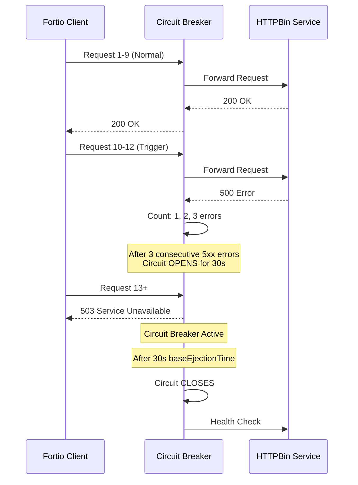
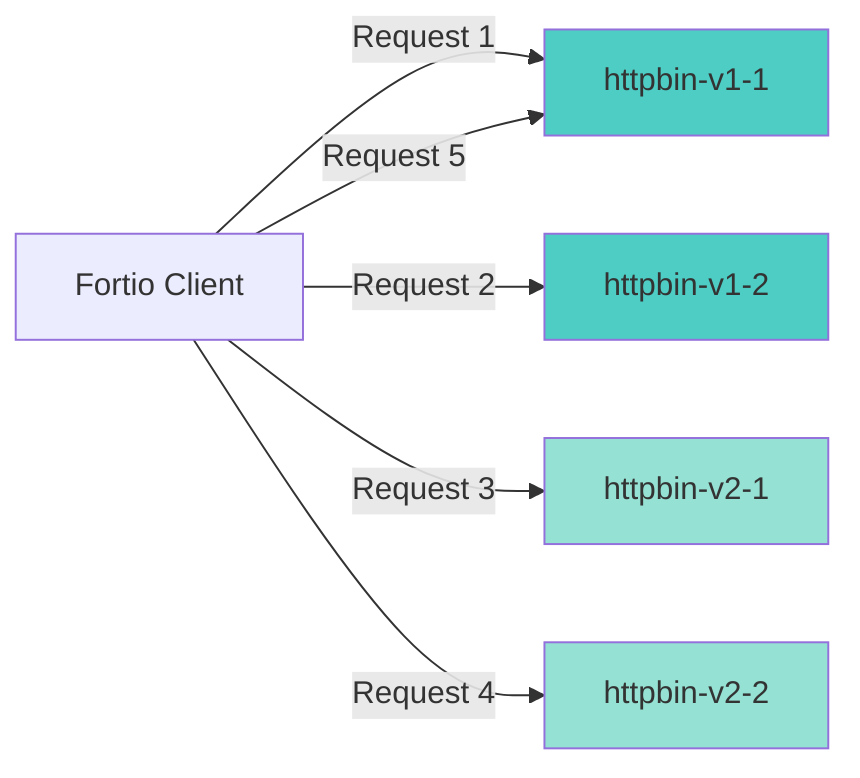
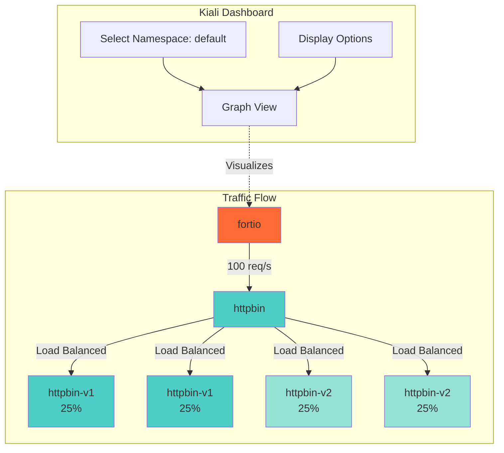

# 🕸️ Istio Service Mesh Demo

> **A comprehensive guide to deploying and testing Istio service mesh features including mTLS, Circuit Breakers, Load Balancing, and Retry Settings on Kubernetes Kind cluster**


## 📋 Table of Contents

- [Overview](#overview)
- [Architecture](#architecture)
- [Prerequisites](#prerequisites)
- [Installation](#installation)
- [Features](#features)
- [Usage](#usage)
- [Troubleshooting](#troubleshooting)
- [Cleanup](#cleanup)

## 🎯 Overview

This project demonstrates Istio service mesh capabilities on a local Kubernetes Kind cluster. It includes practical examples of:

- ✅ **Mutual TLS (mTLS)** - Secure service-to-service communication
- 🔄 **Circuit Breakers** - Prevent cascading failures
- ⚖️ **Load Balancing** - Multiple strategies (Round Robin, Least Request, Random, Consistent Hash)
- 🔁 **Retry Settings** - Automatic retry mechanisms
- 📊 **Traffic Visualization** - Real-time monitoring with Kiali

## 🏗️ Architecture

```mermaid
graph TB
    subgraph "Kubernetes Kind Cluster"
        subgraph "Istio System Namespace"
            Istiod[Istiod<br/>Control Plane]
            Kiali[Kiali<br/>Observability]
            Prometheus[Prometheus<br/>Metrics]
            Grafana[Grafana<br/>Dashboards]
        end
        
        subgraph "Default Namespace"
            Fortio[Fortio<br/>Load Tester]
            
            subgraph "HTTPBin Service"
                V1_1[httpbin-v1<br/>Pod 1]
                V1_2[httpbin-v1<br/>Pod 2]
                V2_1[httpbin-v2<br/>Pod 1]
                V2_2[httpbin-v2<br/>Pod 2]
            end
            
            Service[httpbin Service<br/>:8000]
        end
    end
    
    Fortio -->|HTTP Requests| Service
    Service -->|Load Balanced| V1_1
    Service -->|Load Balanced| V1_2
    Service -->|Load Balanced| V2_1
    Service -->|Load Balanced| V2_2
    
    Istiod -.->|Sidecar Injection| V1_1
    Istiod -.->|Sidecar Injection| V1_2
    Istiod -.->|Sidecar Injection| V2_1
    Istiod -.->|Sidecar Injection| V2_2
    Istiod -.->|Sidecar Injection| Fortio
    
    V1_1 -->|Metrics| Prometheus
    V1_2 -->|Metrics| Prometheus
    V2_1 -->|Metrics| Prometheus
    V2_2 -->|Metrics| Prometheus
    Fortio -->|Metrics| Prometheus
    
    Prometheus -->|Data| Kiali
    Prometheus -->|Data| Grafana
    
    style Istiod fill:#466BB0
    style Kiali fill:#3D3D3D
    style Fortio fill:#FF6B35
    style Service fill:#4ECDC4
```



## 🔧 Prerequisites

### Required Software

| Tool | Version | Purpose |
|------|---------|---------|
| **Docker** | 20.10+ | Container runtime |
| **Kind** | 0.17+ | Local Kubernetes cluster |
| **kubectl** | 1.24+ | Kubernetes CLI |
| **istioctl** | 1.20+ | Istio CLI |

### System Requirements

- **RAM**: 8GB minimum (16GB recommended)
- **CPU**: 4 cores minimum
- **Disk**: 20GB free space
- **OS**: Linux, macOS, or Windows (WSL2)

## 📦 Installation

### Step 1: Install Kind

```bash
# macOS
brew install kind

# Linux
curl -Lo ./kind https://kind.sigs.k8s.io/dl/v0.20.0/kind-linux-amd64
chmod +x ./kind
sudo mv ./kind /usr/local/bin/kind

# Windows (PowerShell)
curl.exe -Lo kind-windows-amd64.exe https://kind.sigs.k8s.io/dl/v0.20.0/kind-windows-amd64
Move-Item .\kind-windows-amd64.exe c:\windows\system32\kind.exe
```

### Step 2: Create Kind Cluster

```bash
# Create cluster
kind create cluster --name istio-demo

# Verify cluster
kubectl cluster-info --context kind-istio-demo
kubectl get nodes
```

### Step 3: Install Istio

```bash
# Download Istio
curl -L https://istio.io/downloadIstio | sh -
cd istio-1.*
export PATH=$PWD/bin:$PATH

# Install Istio with demo profile
istioctl install --set profile=demo -y

# Verify installation
kubectl get pods -n istio-system
istioctl verify-install
```

### Step 4: Install Observability Tools

```bash
# Install Kiali, Prometheus, Grafana, Jaeger
kubectl apply -f samples/addons

# Wait for pods to be ready
kubectl wait --for=condition=ready pod --all -n istio-system --timeout=300s

# Access Kiali dashboard
kubectl port-forward -n istio-system svc/kiali 20001:20001
# Open: http://localhost:20001
```

### Step 5: Enable Sidecar Injection

```bash
# Label default namespace for automatic sidecar injection
kubectl label namespace default istio-injection=enabled

# Verify label
kubectl get namespace default --show-labels
```

## 🚀 Features

### 1️⃣ Circuit Breaker

Protects services from cascading failures by detecting and ejecting unhealthy instances.



**Deploy Circuit Breaker:**

```bash
# Deploy application
kubectl apply -f cb/Deployment.yaml

# Apply circuit breaker rules
kubectl apply -f cb/DestinationRuleCB.yaml

# Test circuit breaker
bash cb/script.sh
```

**Configuration:**
- `consecutive5xxErrors: 3` - Open circuit after 3 consecutive errors
- `interval: 30s` - Check for errors every 30 seconds
- `baseEjectionTime: 30s` - Keep instance ejected for 30 seconds
- `maxEjectionPercent: 100` - Allow ejecting up to 100% of instances

### 2️⃣ Load Balancing Strategies

#### Round Robin (Default)

Distributes requests evenly across all healthy instances.



**Deploy:**

```bash
# Deploy versioned services
kubectl apply -f lbs/httpbin-v1.yaml

# Apply round robin load balancing
kubectl apply -f lbs/lb-round-robin.yaml

# Test distribution
kubectl exec -it deploy/fortio -c fortio -- \
  fortio load -c 1 -n 100 -qps 10 http://httpbin:8000/get
```

#### Other Strategies Available

| Strategy | Use Case | Configuration |
|----------|----------|---------------|
| **LEAST_REQUEST** | Route to least busy pod | Best for varying workloads |
| **RANDOM** | Random distribution | Simple, good for uniform loads |
| **CONSISTENT_HASH** | Session affinity | Sticky sessions by header/cookie |
| **WEIGHTED** | A/B testing | 80% to v1, 20% to v2 |

### 3️⃣ Visualizing Traffic in Kiali



**Access Kiali:**

```bash
# Port forward Kiali
kubectl port-forward -n istio-system svc/kiali 20001:20001

# Open browser: http://localhost:20001

# In Kiali:
# 1. Select namespace: default
# 2. Go to Graph tab
# 3. Select "Workload graph"
# 4. Enable: Traffic Animation, Traffic Distribution, Service Nodes
# 5. Set time range: Last 5 minutes
```

**Generate Traffic:**

```bash
# Generate sustained traffic for visualization
kubectl exec -it deploy/fortio -c fortio -- \
  fortio load -c 2 -qps 10 -t 300s http://httpbin:8000/get
```

## 💻 Usage

### Testing Circuit Breaker

```bash
# 1. Normal requests (should succeed)
kubectl exec deploy/fortio -c fortio -- \
  fortio curl http://httpbin:8000/get

# 2. Trigger circuit breaker with concurrent requests
kubectl exec deploy/fortio -c fortio -- \
  fortio load -c 20 -qps 0 -n 200 http://httpbin:8000/get

# 3. Check if circuit breaker activated
kubectl exec deploy/fortio -c fortio -- \
  fortio load -c 5 -n 50 http://httpbin:8000/get

# Expected: Some requests will fail with 503 (circuit open)
```

### Testing Load Balancing

```bash
# 1. Send 100 requests
kubectl exec deploy/fortio -c fortio -- \
  fortio load -c 1 -n 100 http://httpbin:8000/get

# 2. Check distribution (should be ~25% each pod)
kubectl exec deploy/fortio -c fortio -- \
  fortio load -c 4 -n 400 -qps 50 http://httpbin:8000/headers

# 3. View in Kiali for visual confirmation
```

### Verifying Sidecar Injection

```bash
# Check pods have 2/2 containers (app + istio-proxy)
kubectl get pods

# Expected output:
# NAME                      READY   STATUS
# fortio-xxx                2/2     Running
# httpbin-v1-xxx            2/2     Running
# httpbin-v2-xxx            2/2     Running

# If showing 1/1, restart pods:
kubectl delete pod --all
```

### Advanced Testing

```bash
# Test different QPS rates
kubectl exec deploy/fortio -c fortio -- \
  fortio load -c 10 -qps 50 -t 60s http://httpbin:8000/get

# Test with delays (for timeout testing)
kubectl exec deploy/fortio -c fortio -- \
  fortio load -c 5 -n 20 http://httpbin:8000/delay/2

# Test POST requests
kubectl exec deploy/fortio -c fortio -- \
  fortio load -c 2 -n 50 -payload='{"test":"data"}' \
  http://httpbin:8000/post
```

## 🔍 Troubleshooting

### Issue: No Traffic in Kiali

**Symptom:** Kiali graph shows no traffic or empty graph

**Solution:**

```bash
# 1. Verify sidecar injection
kubectl get pods
# Should show 2/2 (not 1/1)

# 2. Re-enable injection if needed
kubectl label namespace default istio-injection=enabled --overwrite
kubectl delete pod --all

# 3. Verify Prometheus is running
kubectl get pods -n istio-system | grep prometheus

# 4. Generate new traffic
kubectl exec -it deploy/fortio -c fortio -- \
  fortio load -c 2 -qps 5 -t 120s http://httpbin:8000/get
```

### Issue: Circuit Breaker Not Working

**Symptom:** All requests succeed, no 503 errors

**Solution:**

```bash
# 1. Verify DestinationRule is applied
kubectl get destinationrule httpbin-circuit-breaker -o yaml

# 2. Check connection pool settings
kubectl describe destinationrule httpbin-circuit-breaker

# 3. Increase concurrent connections to trigger
kubectl exec deploy/fortio -c fortio -- \
  fortio load -c 30 -qps 0 -n 300 http://httpbin:8000/get
```

### Issue: Pods Not Starting

**Symptom:** Pods stuck in `Pending` or `CrashLoopBackOff`

**Solution:**

```bash
# 1. Check pod status
kubectl describe pod <pod-name>

# 2. Check logs
kubectl logs <pod-name> -c httpbin
kubectl logs <pod-name> -c istio-proxy

# 3. Verify Kind cluster resources
docker stats
```

### Issue: Port Forward Fails

**Symptom:** Cannot access Kiali dashboard

**Solution:**

```bash
# 1. Verify Kiali service exists
kubectl get svc -n istio-system kiali

# 2. Try different port
kubectl port-forward -n istio-system svc/kiali 8080:20001

# 3. Check if port is already in use
lsof -i :20001  # Linux/macOS
netstat -ano | findstr :20001  # Windows
```

## 🧹 Cleanup

```bash
# Delete deployments
kubectl delete -f cb/
kubectl delete -f lbs/

# Delete Istio
istioctl uninstall --purge -y
kubectl delete namespace istio-system

# Delete Kind cluster
kind delete cluster --name istio-demo
```

## 📚 Additional Resources

- [Istio Documentation](https://istio.io/latest/docs/)
- [Kiali Documentation](https://kiali.io/docs/)
- [Fortio Documentation](https://github.com/fortio/fortio)
- [Kind Documentation](https://kind.sigs.k8s.io/)

## 🤝 Contributing

Contributions are welcome! Please feel free to submit a Pull Request.

## 📄 License

This project is open source and available under the MIT License.

---

**Made with ❤️ for learning Istio Service Mesh**


